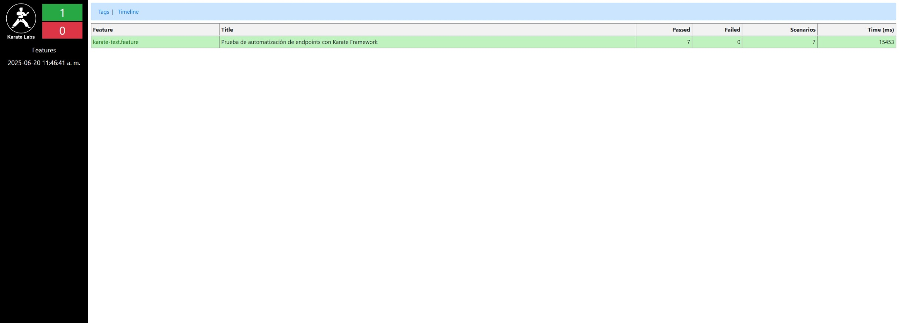
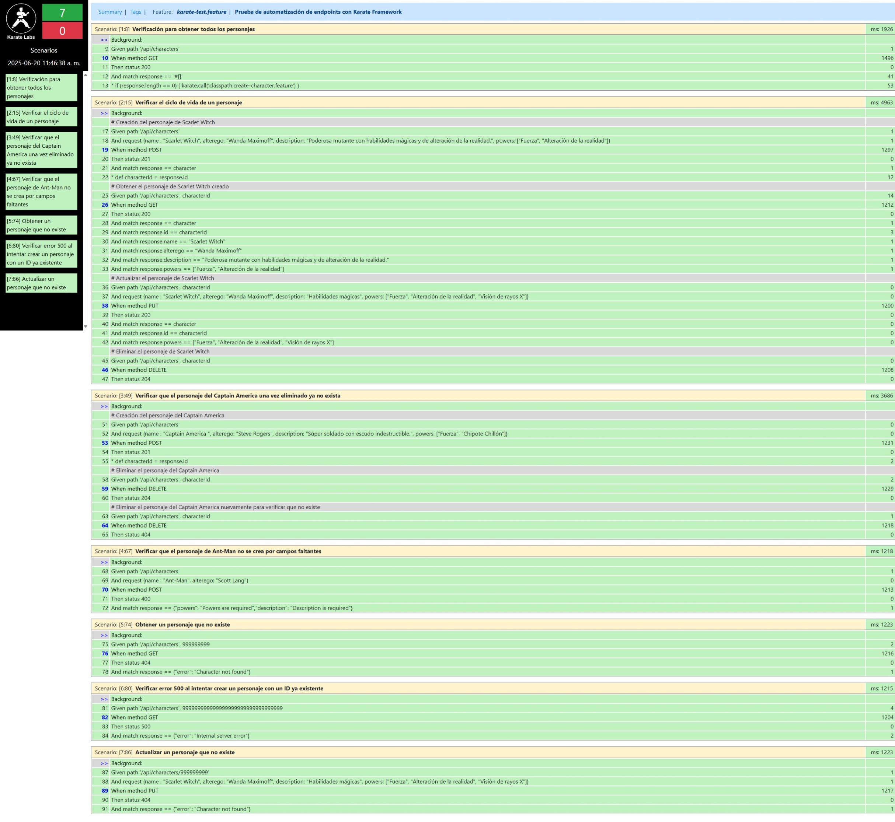

# Proyecto base de pruebas automatizadas con Karate, Java y Gradle

Este proyecto es una base para implementar pruebas automatizadas de la colección de peticiones entregadas (por ejemplo, una colección Postman). Todas las pruebas deben ser escritas en el archivo `src/test/resources/karate-test.feature` siguiendo la sintaxis de Karate DSL.

## Resultados

### 1. Resumen de pruebas

### 2. Detalle de pruebas

